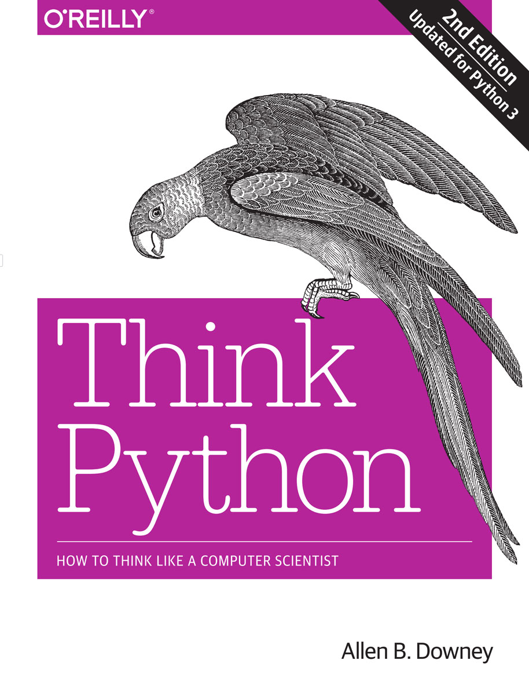

# Think Python 2nd Edition Solutions

All solutions are now in jupyter format.

## Chapter 1
- [x] [Exercise 1-1](./Exercises/E-01/exercise%201-1.ipynb)
- [x] [Exercise 1-2](./Exercises/E-01/exercise%201-2.ipynb)

## Chapter 2
- [x] [Exercise 2-1](./Exercises/E-02/exercise%202-1.ipynb)
- [x] [Exercise 2-2](./Exercises/E-02/exercise%202-2.ipynb)

## Chapter 3
- [x] [Exercise 3-1](./Exercises/E-03/exercise%203-1.ipynb)
- [x] [Exercise 3-2](./Exercises/E-03/exercise%203-2.ipynb)
- [x] [Exercise 3-3](./Exercises/E-03/exercise%203-3.ipynb)

